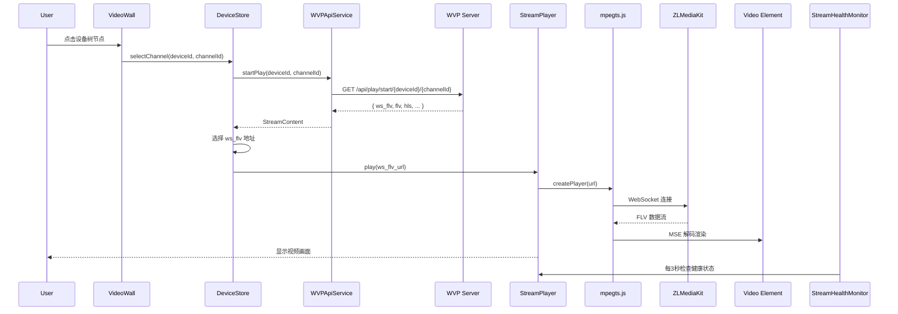
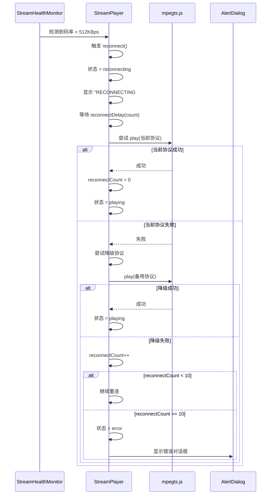

# WVP-GB28181-Pro 完整集成设计方案

> **文档版本**: v1.0  
> **创建日期**: 2026-04-01  
> **状态**: 已批准  
> **实现方案**: 方案2 - 完整实现  
> **预计周期**: 6-7 天  

---

## 一、项目背景与问题分析

### 1.1 核心问题

**原实现的主要缺陷**：

1. **错误的 API 调用方式**
   - 使用 `/api/media/getPlayUrl`（推流场景API）
   - 应该使用 `/api/play/start/{deviceId}/{channelId}`（点播场景API）

2. **硬编码播放地址**
   - `VideoWall.vue:85` 硬编码测试地址：`ws://192.168.2.38/rtp/...`
   - 未真正使用 WVP API 获取动态地址

3. **缺失的点播流程**
   - 正确流程：登录 → 获取设备 → 开始点播 → 获取播放地址 → 播放
   - 原流程：直接使用固定地址，无法动态适配设备状态

### 1.2 正确的 API 使用方式

**WVP API 调用对比**：

| 原实现（错误） | 新实现（正确） | 场景 |
|---|---|---|
| `/api/media/getPlayUrl?app=live&stream=...` | `/api/play/start/{deviceId}/{channelId}` | 点播 |
| 推流场景，获取已存在的流地址 | 点播场景，触发设备推流并返回地址 | 区别 |
| 无需认证（可能） | 需要认证（access-token） | 安全 |

**正确的点播 API 返回格式**：

```json
{
  "code": 0,
  "msg": "success",
  "data": {
    "deviceId": "41010500001320000177",
    "channelId": "41010500001320000177",
    "stream": "41010500001320000177_41010500001320000177",
    "app": "rtp",
    "ip": "192.168.2.38",
    "flv": "http://192.168.2.38/rtp/...live.flv",
    "ws_flv": "ws://192.168.2.38/rtp/...live.flv",
    "hls": "http://192.168.2.38/rtp/...live.m3u8",
    "fmp4": "http://192.168.2.38/rtp/...live.mp4",
    ...
  }
}
```

### 1.3 播放器选择

**稳定性对比分析**：

| 播放器 | 解码方式 | 稳定性 | 内存占用 | Win7兼容 | 推荐度 |
|--------|---------|--------|---------|---------|--------|
| **mpegts.js** | MSE 硬解 | ⭐⭐⭐⭐⭐ | 低（~50MB/路） | ✅ 好 | **首选** |
| EasyPro | 软解/硬解混合 | ⭐⭐⭐⭐ | 中等 | ⭐⭐⭐ | 备选 |
| Jessibuca | WASM 软解 | ⭐⭐ | 高（~200MB/路） | ❌ 差（黑屏） | 不推荐 |

**推荐 mpegts.js 的理由**：

1. **MSE 硬解** - 利用浏览器原生解码，CPU占用低（< 10%）
2. **内存管理良好** - 自动清理缓冲区，避免溢出
3. **Win7 兼容** - IE11+、Chrome、Firefox 都支持 MSE
4. **自动缓冲** - 网络抖动时消耗缓冲，不黑屏
5. **开源成熟** - B站开源，大规模验证

**内存管理策略**（关键）：

```typescript
// 动态缓冲配置（避免内存溢出）
const bufferConfig = {
  '1-4路': { stashInitialSize: 512 * 1024 },      // 0.5MB
  '5-9路': { stashInitialSize: 1024 * 1024 },     // 1MB
  '10-16路': { stashInitialSize: 2048 * 1024 }    // 2MB
}

// 定期清理缓冲区（每30秒）
setInterval(() => {
  if (player.bufferedLength > maxBufferLength) {
    player.flushBuffer() // 主动清理，避免溢出
  }
}, 30000)

// 销毁播放器时彻底清理
function destroyPlayer() {
  player.destroy()
  player = null
  videoElement.src = '' // 清空 video 元素
}
```

---

## 二、系统架构设计

### 2.1 整体架构

```
┌─────────────────────────────────────────────────────────┐
│  WVP-GB28181-Pro Server          Electron Client        │
│  ┌──────────────────┐            ┌──────────────────┐  │
│  │ 设备管理/信令    │──HTTP────▶│ WVPApiService    │  │
│  │ /api/play/start  │            │ (正确API调用)    │  │
│  │ /api/device/list │            │ - login          │  │
│  └──────────────────┘            │ - getDevices     │  │
│           │                      │ - getChannels    │  │
│           │                      │ - startPlay ✓    │  │
│  ┌──────────────────┐            │ - stopPlay       │  │
│  │ ZLMediaKit       │            └──────────────────┘  │
│  │ (流媒体服务器)    │                    │              │
│  │ - HTTP-FLV       │                    │              │
│  │ - WS-FLV ✓       │            ┌──────────────────┐  │
│  │ - HLS            │──WS-FLV───▶│ StreamPlayer     │  │
│  └──────────────────┘            │ (mpegts.js)      │  │
│                                  │ - 自动重连       │  │
│                                  │ - 协议降级       │  │
│                                  │ - 内存管理       │  │
│                                  └──────────────────┘  │
│                                           │              │
│                                  ┌──────────────────┐  │
│                                  │ StreamHealthMon  │  │
│                                  │ - 断流检测       │  │
│                                  │ - 自动恢复       │  │
│                                  └──────────────────┘  │
└─────────────────────────────────────────────────────────┘
```

### 2.2 核心流程

**点播播放流程**：

```
1. 用户登录 WVP
   → WVPApiService.login('admin', 'admin')
   → 获取 accessToken

2. 获取设备列表
   → WVPApiService.getDevices()
   → 返回 [{ deviceId, name, status, channels }]

3. 获取设备通道
   → WVPApiService.getChannels(deviceId)
   → 返回 [{ channelId, name, status }]

4. 用户选择通道（点击树节点）
   → UI 触发事件

5. 开始点播（关键步骤）
   → WVPApiService.startPlay(deviceId, channelId)
   → 返回 StreamContent { ws_flv, flv, hls, ... }

6. 选择播放地址（协议优先级）
   → 优先 ws_flv（穿透性好）
   → 备选 flv（稳定性好）
   → 兜底 hls（兼容性好）

7. 开始播放
   → StreamPlayer.play(ws_flv_url)
   → mpegts.js 解码 → video 元素渲染

8. 健康监控（后台）
   → StreamHealthMonitor 每 3 秒检查
   → 发现断流 → 自动重连

9. 停止点播（用户退出）
   → WVPApiService.stopPlay(deviceId, channelId)
   → 释放资源，清理内存
```

---

## 三、核心组件设计

### 3.1 WVPApiService（API 服务层）

**职责**：封装 WVP 所有 API，正确处理认证、错误、Token管理

**文件位置**：`src/services/wvp-api.ts`

**关键方法**：

```typescript
export interface StreamContent {
  deviceId: string
  channelId: string
  stream: string
  app: string
  flv?: string       // HTTP-FLV 地址
  ws_flv?: string    // WebSocket-FLV 地址 ✓ 优先
  hls?: string       // HLS 地址
  fmp4?: string      // FMP4 地址
  rtmp?: string      // RTMP 地址
}

export class WVPApiService {
  private baseUrl: string
  private token: string
  private tokenExpireTime: number

  // 认证
  async login(username: string, password: string): Promise<string> {
    const md5Password = CryptoJS.MD5(password).toString()
    const res = await fetch(
      `${this.baseUrl}/api/user/login?username=${username}&password=${md5Password}`,
      { method: 'GET' }
    )
    const data = await res.json()
    this.token = data.data.accessToken
    this.tokenExpireTime = Date.now() + 3600000 // 1小时
    return this.token
  }

  // 设备管理
  async getDevices(): Promise<WVPDevice[]> {
    const res = await fetch(`${this.baseUrl}/api/v1/device/list`, {
      headers: { 'access-token': this.token }
    })
    return data.DeviceList.map(d => ({
      deviceId: d.ID,
      name: d.Name,
      status: d.Online ? 'online' : 'offline',
      channels: []
    }))
  }

  async getChannels(deviceId: string): Promise<WVPChannel[]> {
    const res = await fetch(
      `${this.baseUrl}/api/v1/device/channellist?serial=${deviceId}`,
      { headers: { 'access-token': this.token } }
    )
    return data.ChannelList.map(c => ({
      channelId: c.ID,
      name: c.Name,
      status: c.Online ? 'online' : 'offline'
    }))
  }

  // 点播控制（关键修正）✓
  async startPlay(
    deviceId: string, 
    channelId: string
  ): Promise<StreamContent> {
    const res = await fetch(
      `${this.baseUrl}/api/play/start/${deviceId}/${channelId}`,
      { headers: { 'access-token': this.token } }
    )
    const data = await res.json()
    if (data.code !== 0) {
      throw new Error(data.msg || 'Play start failed')
    }
    return data.data // StreamContent 包含所有地址
  }

  async stopPlay(deviceId: string, channelId: string): Promise<void> {
    await fetch(
      `${this.baseUrl}/api/play/stop/${deviceId}/${channelId}`,
      { 
        method: 'GET',
        headers: { 'access-token': this.token } 
      }
    )
  }

  // Token 自动刷新
  private async refreshTokenIfNeeded(): Promise<void> {
    if (Date.now() > this.tokenExpireTime - 300000) { // 5分钟前
      await this.login(this.username, this.password)
    }
  }
}
```

---

### 3.2 DeviceStore（状态管理）

**职责**：管理设备树、选中通道、播放状态

**文件位置**：`src/stores/device-store.ts`

**状态结构**：

```typescript
export interface SelectedChannel {
  deviceId: string
  channelId: string
  name: string
  playUrl?: string
  streamContent?: StreamContent
  status: 'idle' | 'connecting' | 'playing' | 'error'
  playerIndex: number // 在网格中的位置
}

export const useDeviceStore = defineStore('device', {
  state: () => ({
    devices: [] as WVPDevice[],
    selectedChannels: [] as SelectedChannel[], // 最多16路
    currentLayout: '3x3' as '3x3' | '4x4',
    wvpApi: null as WVPApiService | null,
    wvpConnected: false,
    
    // 播放器状态映射
    playerStates: new Map<string, {
      status: string
      reconnectCount: number
      lastBitrate: number
    }>()
  }),

  actions: {
    async initializeWVP(baseUrl: string) {
      this.wvpApi = new WVPApiService(baseUrl)
      await this.wvpApi.login('admin', 'admin')
      this.wvpConnected = true
    },

    async loadDevices() {
      const devices = await this.wvpApi.getDevices()
      for (const device of devices) {
        device.channels = await this.wvpApi.getChannels(device.deviceId)
      }
      this.devices = devices
    },

    async selectChannel(deviceId: string, channelId: string) {
      // 限制最多16路
      if (this.selectedChannels.length >= 16) {
        // 替换最早的一路
        this.selectedChannels.shift()
      }

      const streamContent = await this.wvpApi.startPlay(deviceId, channelId)
      
      // 协议选择优先级
      const playUrl = streamContent.ws_flv || streamContent.flv || streamContent.hls
      
      this.selectedChannels.push({
        deviceId,
        channelId,
        name: `${deviceId}/${channelId}`,
        playUrl,
        streamContent, // 保存完整数据用于降级
        status: 'connecting',
        playerIndex: this.selectedChannels.length
      })
    },

    async stopChannel(index: number) {
      const channel = this.selectedChannels[index]
      await this.wvpApi.stopPlay(channel.deviceId, channel.channelId)
      this.selectedChannels.splice(index, 1)
    }
  }
})
```

---

### 3.3 StreamPlayer（播放器组件）

**职责**：mpegts.js 播放 + 自动重连 + 协议降级 + 内存管理

**文件位置**：`src/components/VideoPlayer/StreamPlayer.vue`

**关键特性**：

1. **协议降级策略**：

```typescript
const protocolPriority = ['ws_flv', 'flv', 'hls']

async function playWithFallback(streamContent: StreamContent) {
  for (const protocol of protocolPriority) {
    const url = streamContent[protocol]
    if (!url) continue
    
    try {
      await this.playInternal(url, protocol)
      this.currentProtocol = protocol
      return // 成功，退出
    } catch (error) {
      console.warn(`${protocol} failed:`, error.message)
      this.reconnectCount++
      continue // 失败，尝试下一个协议
    }
  }
  
  // 所有协议都失败
  this.status = 'error'
  this.showAlertDialog = true
}
```

2. **自动重连逻辑**：

```typescript
// 重连策略
const reconnectDelay = (count: number) => {
  if (count <= 5) return 1000      // 前5次：1秒
  if (count <= 10) return 3000     // 6-10次：3秒
  return 5000                       // 超过10次：5秒
}

async function reconnect() {
  if (this.reconnectCount >= 10) {
    this.status = 'error'
    return
  }
  
  this.status = 'reconnecting'
  this.showReconnectOverlay = true
  
  await sleep(reconnectDelay(this.reconnectCount))
  
  // 先尝试当前协议
  try {
    await this.playInternal(this.playUrl, this.currentProtocol)
    this.reconnectCount = 0
    this.status = 'playing'
    return
  } catch {}
  
  // 当前协议失败，尝试降级
  await this.playWithFallback(this.streamContent)
}

// 断流检测（由 HealthMonitor 触发）
function onStreamStalled() {
  console.log('Stream stalled, reconnecting...')
  this.reconnect()
}
```

3. **内存管理**：

```typescript
// 动态缓冲配置
function getBufferConfig(playerCount: number) {
  if (playerCount <= 4) {
    return { stashInitialSize: 512 * 1024, lazyLoad: true }
  }
  if (playerCount <= 9) {
    return { stashInitialSize: 1024 * 1024, lazyLoad: true }
  }
  return { stashInitialSize: 2048 * 1024, lazyLoad: true }
}

// 定期清理缓冲区
function setupBufferCleanup() {
  this.bufferCleanupTimer = setInterval(() => {
    if (this.player && this.player.bufferedLength > this.maxBufferLength) {
      this.player.flushBuffer()
      console.log('Buffer flushed to prevent memory overflow')
    }
  }, 30000) // 每30秒检查
}

// 销毁时彻底清理
function destroyPlayer() {
  if (this.bufferCleanupTimer) {
    clearInterval(this.bufferCleanupTimer)
  }
  if (this.player) {
    this.player.destroy()
    this.player = null
  }
  this.videoElement.src = ''
  this.videoElement.load() // 强制清理内存
}
```

---

### 3.4 StreamHealthMonitor（健康监控）

**职责**：实时监控所有播放流的健康状态，触发自动重连

**文件位置**：`src/services/stream-health-monitor.ts`

**监控逻辑**：

```typescript
export class StreamHealthMonitor {
  private players: Map<string, StreamPlayer>
  private checkInterval: number = 3000 // 3秒检查一次
  private minBitrate: number = 512 * 1024 // 最小码率 512KBps

  startMonitoring() {
    this.timer = setInterval(() => {
      for (const [id, player] of this.players) {
        this.checkPlayerHealth(player)
      }
    }, this.checkInterval)
  }

  private checkPlayerHealth(player: StreamPlayer) {
    const stats = player.getStats()
    const bitrate = stats.bitrate || 0
    
    // 记录历史码率
    player.recordBitrate(bitrate)
    
    // 断流检测：码率低于阈值持续3次
    if (bitrate < this.minBitrate) {
      player.stalledCount++
      if (player.stalledCount >= 3) {
        console.warn(`Stream ${id} stalled, triggering reconnect`)
        player.triggerReconnect()
        player.stalledCount = 0
      }
    } else {
      player.stalledCount = 0
    }
    
    // 更新信号质量指示器
    if (bitrate > 1024 * 1024) {
      player.signalQuality = 'good'   // > 1Mbps: 绿色
    } else if (bitrate > this.minBitrate) {
      player.signalQuality = 'fair'   // 512KB-1MB: 黄色
    } else {
      player.signalQuality = 'poor'   // < 512KB: 红色
    }
  }

  stopMonitoring() {
    clearInterval(this.timer)
  }
}
```

---

### 3.5 VideoWall（大屏组件）

**职责**：设备树 + 视频网格 + 布局切换

**文件位置**：`src/views/video/VideoWall.vue`

**UI 结构**：

```
┌──────────────────────────────────────────────────────┐
│ 工具栏: [布局: 3x3/4x4] [刷新] [全屏] [停止全部]     │
├─────────────┬────────────────────────────────────────┤
│ 设备树      │  视频网格 (3x3 或 4x4)                 │
│ ├ 设备1 ✓   │  ┌────┬────┬────┬────┐               │
│ │ ├ 通1 ✓   │  │ 1  │ 2  │ 3  │ 4  │               │
│ │ ├ 通2     │  ├────┼────┼────┼────┤               │
│ │ ├ 通3     │  │ 5  │ 6  │ 7  │ 8  │               │
│ ├ 设备2     │  ├────┼────┼────┼────┤               │
│ │ ├ 通1     │  │ 9  │10  │11  │12  │               │
│ │ ├ 通2     │  ├────┼────┼────┼────┤               │
│             │  │13  │14  │15  │16  │               │
│             │  └────┴────┴────┴────┘               │
└─────────────┴────────────────────────────────────────┘
```

**交互逻辑**：

```vue
<script setup lang="ts">
import { useDeviceStore } from '@/stores/device-store'

const store = useDeviceStore()

// 点击通道节点
async function handleChannelClick(deviceId: string, channelId: string) {
  try {
    await store.selectChannel(deviceId, channelId)
  } catch (error) {
    // 显示错误提示
    showErrorToast(`点播失败: ${error.message}`)
  }
}

// 布局切换
function toggleLayout() {
  store.currentLayout = store.currentLayout === '3x3' ? '4x4' : '3x3'
}

// 停止所有播放
async function stopAll() {
  for (let i = 0; i < store.selectedChannels.length; i++) {
    await store.stopChannel(i)
  }
  store.selectedChannels = []
}
</script>
```

---

## 四、数据流设计

### 4.1 正常播放流程



### 4.2 断流重连流程



---

## 五、错误处理设计

### 5.1 错误类型与处理

| 错误类型 | 处理策略 | 用户反馈 | 代码位置 |
|---|---|---|---|
| **API 认证失败** | 显示 Snackbar，手动重新登录 | "登录失败，请检查账号密码" | WVPApiService.login() |
| **Token 过期** | 自动刷新 Token，失败后提示重新登录 | 后台自动处理，失败时提示 | WVPApiService.refreshToken() |
| **设备离线** | 设备树节点灰色显示，禁用点击 | 灰色图标，Tooltip 显示 "离线" | DeviceStore.loadDevices() |
| **点播失败** | 自动重试3次，失败后 AlertDialog | "点播失败：设备未响应" | DeviceStore.selectChannel() |
| **播放断流** | 自动重连 + 协议降级 | "RECONNECTING" Overlay | StreamPlayer.reconnect() |
| **播放失败超过10次** | AlertDialog，用户手动 Retry | "播放失败，点击重试" | StreamPlayer.playWithFallback() |

### 5.2 错误处理代码示例

```typescript
// API 错误处理
async function apiCallWithRetry<T>(
  fn: () => Promise<T>,
  maxRetries: number = 3
): Promise<T> {
  for (let i = 0; i < maxRetries; i++) {
    try {
      await this.refreshTokenIfNeeded()
      return await fn()
    } catch (error) {
      if (i === maxRetries - 1) {
        throw error
      }
      await sleep(1000 * (i + 1))
    }
  }
}

// 点播失败处理
async function selectChannel(deviceId: string, channelId: string) {
  try {
    const streamContent = await apiCallWithRetry(() => 
      this.wvpApi.startPlay(deviceId, channelId)
    )
    
    const playUrl = streamContent.ws_flv || streamContent.flv || streamContent.hls
    
    if (!playUrl) {
      throw new Error('No playable URL available')
    }
    
    this.selectedChannels.push({ ... })
  } catch (error) {
    // 显示 AlertDialog
    showErrorDialog({
      title: '点播失败',
      message: error.message,
      action: 'Retry',
      onAction: () => this.selectChannel(deviceId, channelId)
    })
  }
}
```

---

## 六、内存管理设计

### 6.1 内存占用预估

| 场景 | 每路内存 | 总内存（16路） | 管理策略 |
|---|---|---|---|
| **mpegts.js 播放器** | ~50MB | ~800MB | 动态缓冲 + 定期清理 |
| **视频解码** | ~20MB | ~320MB | MSE 硬解，GPU 承担 |
| **UI 渲染** | ~10MB | ~160MB | Vue 响应式，自动优化 |
| **总计** | ~80MB | ~1280MB | < 2GB，可控 |

### 6.2 内存管理策略

**策略1：动态缓冲配置**

```typescript
// 根据并发路数调整缓冲大小
function getBufferConfig(playerCount: number) {
  if (playerCount <= 4) {
    return { 
      stashInitialSize: 512 * 1024,  // 0.5MB
      lazyLoad: true,
      lazyLoadMaxDuration: 3 * 60 * 1000  // 3分钟
    }
  }
  if (playerCount <= 9) {
    return {
      stashInitialSize: 1024 * 1024,  // 1MB
      lazyLoad: true,
      lazyLoadMaxDuration: 3 * 60 * 1000
    }
  }
  return {
    stashInitialSize: 2048 * 1024,  // 2MB
    lazyLoad: true,
    lazyLoadMaxDuration: 3 * 60 * 1000
  }
}
```

**策略2：定期清理缓冲区**

```typescript
// 每30秒检查并清理缓冲区
function setupBufferCleanup(player: mpegts.Player) {
  return setInterval(() => {
    const bufferedLength = player.bufferedLength
    const maxBufferLength = 10 * 1024 * 1024 // 10MB
    
    if (bufferedLength > maxBufferLength) {
      player.flushBuffer()
      console.log(`Buffer flushed: ${bufferedLength} -> ${player.bufferedLength}`)
    }
  }, 30000)
}
```

**策略3：销毁时彻底清理**

```typescript
function destroyPlayer(player: mpegts.Player, videoEl: HTMLVideoElement) {
  // 1. 停止定时器
  clearInterval(bufferCleanupTimer)
  
  // 2. 销毁 mpegts.js 播放器
  if (player) {
    player.destroy()
    player = null
  }
  
  // 3. 清空 video 元素
  videoEl.src = ''
  videoEl.load()
  
  // 4. 清理 StreamContent 数据
  streamContent = null
  playUrl = null
  
  console.log('Player destroyed, memory cleaned')
}
```

**策略4：监控内存占用**

```typescript
// 每5分钟检查内存占用
function monitorMemoryUsage() {
  setInterval(() => {
    const memory = performance.memory
    if (memory) {
      const usedMB = memory.usedJSHeapSize / 1024 / 1024
      const limitMB = memory.jsHeapSizeLimit / 1024 / 1024
      
      console.log(`Memory: ${usedMB}MB / ${limitMB}MB`)
      
      if (usedMB > limitMB * 0.8) { // 超过80%
        console.warn('Memory usage high, consider reducing buffer')
        // 自动降低缓冲配置
        adjustBufferConfig(0.5)
      }
    }
  }, 300000) // 5分钟
}
```

---

## 七、测试策略

### 7.1 功能测试

| 测试项 | 测试方法 | 验证点 |
|---|---|---|
| **登录认证** | 正确密码 / 错误密码 | Token 获取 / 错误提示 |
| **设备列表加载** | 查看设备树 | 显示在线/离线设备 |
| **通道列表加载** | 点击设备节点 | 显示该设备所有通道 |
| **点播流程** | 点击通道节点 | startPlay API 调用正确 |
| **播放地址获取** | 查看返回数据 | 包含 ws_flv/flv/hls 地址 |
| **协议选择** | 断开 ws-flv | 自动切换到 flv |
| **停止点播** | 点击停止按钮 | stopPlay API 调用正确 |
| **内存清理** | 停止播放后检查 | 内存释放 |

### 7.2 性能测试

| 测试项 | 测试条件 | 验证指标 |
|---|---|---|
| **16路并发** | 同时播放16路视频 | CPU < 60%，内存 < 2GB |
| **长时间播放** | 连续播放24小时 | 无黑屏，无内存溢出 |
| **网络抖动** | 断网10秒后恢复 | 自动重连成功 |
| **协议降级** | 手动阻塞 ws-flv 端口 | 自动切换到 http-flv |

### 7.3 兼容性测试

| 环境 | 测试内容 | 验证点 |
|---|---|---|
| **Win7 + Chrome** | 播放16路 | MSE 硬解正常 |
| **Win7 + IE11** | 播放16路 | MSE 硬解正常 |
| **跨网段** | WS-FLV 连接 | WebSocket 穿透成功 |
| **H.264 vs H.265** | 不同编码设备 | H.264 硬解，H.265 转码 |

---

## 八、实施路线图

### Phase 1: WVP API 服务层（1-2天）

**任务清单**：

- [ ] 创建 `src/services/wvp-api.ts`（正确的 API 实现）
- [ ] 实现 `login()` 方法（MD5加密 + Token管理）
- [ ] 实现 `getDevices()` 方法（获取设备列表）
- [ ] 实现 `getChannels()` 方法（获取设备通道）
- [ ] 实现 `startPlay()` 方法（点播 API ✓）
- [ ] 实现 `stopPlay()` 方法（停止点播）
- [ ] 实现 Token 自动刷新机制
- [ ] 编写单元测试（API 调用正确性）

**验证方法**：

```bash
# 运行测试
npm run test:unit

# 手动验证 API
curl -X GET "http://192.168.2.38:18080/api/user/login?username=admin&password=21232f297a57a5a743894a0e4a801fc3"
# 返回: { "code": 0, "data": { "accessToken": "xxx" } }

curl -X GET "http://192.168.2.38:18080/api/play/start/41010500001320000177/41010500001320000177" \
  -H "access-token: xxx"
# 返回: { "code": 0, "data": { "ws_flv": "ws://...", "flv": "http://...", ... } }
```

---

### Phase 2: 设备状态管理（1天）

**任务清单**：

- [ ] 创建 `src/stores/device-store.ts`（Pinia）
- [ ] 定义 `DeviceState` 状态结构
- [ ] 实现 `initializeWVP()` action
- [ ] 实现 `loadDevices()` action（加载设备树）
- [ ] 实现 `selectChannel()` action（选择通道播放）
- [ ] 实现 `stopChannel()` action（停止播放）
- [ ] 实现布局切换功能（3x3/4x4）
- [ ] 编写状态管理测试

---

### Phase 3: StreamPlayer 组件（2天）

**任务清单**：

- [ ] 重构 `src/components/VideoPlayer/StreamPlayer.vue`
- [ ] 集成 mpegts.js（正确配置）
- [ ] 实现协议降级逻辑（ws_flv → flv → hls）
- [ ] 实现自动重连逻辑（重连策略）
- [ ] 实现内存管理（动态缓冲 + 定期清理）
- [ ] 实现信号质量指示器
- [ ] 实现 UI 状态显示（Skeleton、Reconnect Overlay、AlertDialog）
- [ ] 编写播放器测试

---

### Phase 4: StreamHealthMonitor（1天）

**任务清单**：

- [ ] 创建 `src/services/stream-health-monitor.ts`
- [ ] 实现健康检查逻辑（每3秒检查）
- [ ] 实现断流检测（码率阈值）
- [ ] 实现自动触发重连
- [ ] 实现信号质量更新
- [ ] 集成到 StreamPlayer 组件

---

### Phase 5: VideoWall 组件（1-2天）

**任务清单**：

- [ ] 重构 `src/views/video/VideoWall.vue`
- [ ] 实现设备树 UI（shadcn-vue Tree 组件）
- [ ] 实现视频网格布局（3x3/4x4 切换）
- [ ] 实现交互逻辑（点击通道 → 播放）
- [ ] 实现工具栏（布局切换、刷新、停止全部）
- [ ] 实现错误反馈（Snackbar、AlertDialog）
- [ ] 集成所有组件和服务

---

### Phase 6: 测试与优化（1天）

**任务清单**：

- [ ] 功能测试（登录、点播、播放、停止）
- [ ] 性能测试（16路并发、内存占用）
- [ ] 稳定性测试（长时间播放、网络抖动）
- [ ] 兼容性测试（Win7、跨网段）
- [ ] UI/UX 调优（响应速度、视觉效果）
- [ ] 内存泄漏检查（Chrome DevTools Memory Profiler）

---

## 九、关键决策记录

### 决策1：播放器选择

**决策**：使用 mpegts.js（而不是 Jessibuca 或 EasyPro）

**理由**：

1. MSE 硬解稳定性高，CPU 占用低
2. 内存管理良好，避免溢出
3. Win7 兼容性好（IE11+、Chrome）
4. 开源成熟，B站大规模验证

**替代方案**：如果 mpegts.js 在特殊设备上有问题，可尝试 EasyPro（商业方案）

---

### 册策2：API 调用方式

**决策**：使用 `/api/play/start/{deviceId}/{channelId}` 点播 API

**理由**：

1. 这是正确的点播场景 API
2. 返回完整的 StreamContent（包含所有协议地址）
3. WVP 会触发设备推流，然后返回地址
4. 原实现使用的 `/api/media/getPlayUrl` 是推流场景，不适用于点播

---

### 册策3：协议优先级

**决策**：ws-flv → flv → hls

**理由**：

1. ws-flv：WebSocket 穿透性好，适合跨网段
2. flv：HTTP 稳定性好，但需要网络直连
3. hls：兼容性最好，但延迟高（> 5秒）

---

### 册策4：内存管理

**决策**：动态缓冲 + 定期清理 + 销毁时彻底清理

**理由**：

1. 16路并发可能导致内存溢出（每路~50MB）
2. 动态缓冲根据并发路数调整大小
3. 定期清理避免缓冲区无限增长
4. 销毁时彻底清理避免内存泄漏

---

## 十、风险与缓解

| 风险 | 影响 | 缓解措施 |
|---|---|---|
| **H.265 设备无法硬解** | 部分设备播放失败 | WVP 配置 ZLM 自动转码 H.264 |
| **Token 过期导致播放中断** | 用户需要重新登录 | Token 自动刷新机制（30分钟检查） |
| **16路并发导致内存溢出** | 浏览器崩溃 | 动态缓冲 + 定期清理 + 监控 |
| **网络抖动导致断流** | 画面暂停或黑屏 | 自动重连 + 协议降级 + 缓冲策略 |
| **跨网段无法连接** | ws-flv 连接失败 | 协议降级到 http-flv 或 hls |
| **WVP API 变更** | 接口不兼容 | API 服务层封装，便于适配 |

---

## 十一、验收标准

### 功能验收

- ✅ 登录认证成功，Token 管理正常
- ✅ 设备树正确显示在线/离线设备
- ✅ 点播流程正确：startPlay → 获取地址 → 播放
- ✅ 播放器支持 ws-flv、http-flv、hls 三种协议
- ✅ 自动重连机制生效，断流后自动恢复
- ✅ 协议降级机制生效，ws-flv 失败后切换到 flv
- ✅ 停止播放正确调用 stopPlay API，释放资源

### 性能验收

- ✅ 16路并发播放，CPU < 60%，内存 < 2GB
- ✅ 连续播放24小时，无黑屏，无内存溢出
- ✅ 首帧时间 < 2秒
- ✅ 重连时间 < 3秒

### 兼容性验收

- ✅ Win7 + Chrome 正常播放
- ✅ Win7 + IE11 正常播放（MSE 支持）
- ✅ 跨网段 ws-flv 连接成功

---

## 十二、后续优化方向

1. **云台控制集成**：在播放器中添加云台控制按钮（上下左右、放大缩小）
2. **录像回放功能**：调用 WVP 录像 API，实现历史录像回放
3. **多用户支持**：不同用户登录，获取不同的设备权限
4. **播放器布局自定义**：用户自定义网格布局（如 2x2、5x5）
5. **性能监控面板**：实时显示 CPU、内存、网络占用情况

---

**文档编写完成，等待用户确认后调用 writing-plans skill 创建详细实施计划**